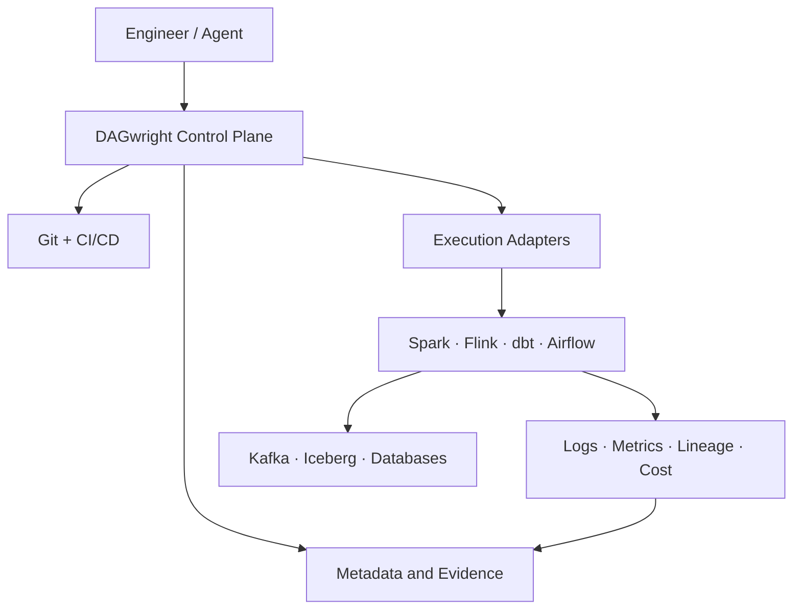
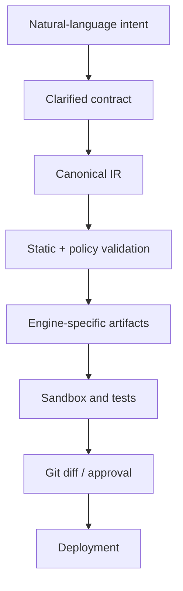

# DAGwright — Open Agentic Data Engineering Platform

> **Project name:** DAGwright
> **Category:** Open Agentic Data Engineering Platform
> **Tagline:** The open agentic data engineer
> **Naming status:** Provisional pending final repository, domain, package-registry, and trademark clearance
> **Status:** Architecture and implementation game plan
> **License target:** Apache License 2.0
> **Revision:** 2026-08-22

---

## 1. Executive Decision

The project inspired by the Databricks article should be a separate project from OpenLTAP.

OpenLTAP is a storage and consistency project. DAGwright is an agent-native control plane that builds and operates data pipelines across existing open-source engines.

The project should not attempt to recreate all of Databricks. It should provide the missing open coordination layer across:

- ingestion;
- declarative batch and streaming pipelines;
- orchestration;
- metadata and lineage;
- data contracts and quality;
- observability and cost;
- incident diagnosis and safe remediation;
- AI-agent access, governance, and audit.

The central product statement is:

> **Describe the desired data product and its operational contract. The platform compiles it into a reviewable, testable, deployable pipeline for the engines you already use, then continuously verifies and operates it with evidence.**

The differentiator is not an LLM that writes SQL. The differentiator is a deterministic, contract-driven control loop around probabilistic agents.

---

## 2. Relationship to the Databricks Announcements

The article is broad and Medium did not expose its complete text to automated reading. The architecture therefore uses the capabilities independently confirmed in the corresponding Databricks and open-source announcements.

| Databricks direction | Open project response |
|---|---|
| Natural-language pipeline creation | Intent-to-contract workflow with clarification before generation |
| Spark Declarative Pipelines | Compile to the open Spark framework; do not reimplement it |
| Lakeflow Jobs and integrations | Engine-neutral execution adapters |
| Visual pipeline designer | Contract and DAG editor backed by the same textual source of truth |
| Genie Code for data engineering | Specialist agents with deterministic validation |
| ZeroOps | Evidence-based detection, impact analysis, diagnosis, and gated repair |
| Unity Catalog lineage/governance | Open metadata graph and policy abstraction |
| MCP and agent platform | First-class MCP gateway, identity, policy, and audit |
| Serverless/proprietary runtimes | Self-hosted Docker/Kubernetes execution over open engines |

This is not OpenLTAP. DAGwright can later treat OpenLTAP as one supported storage/execution target.

---

## 3. Problem Statement

Modern data engineering is fragmented across many independently useful tools. A production pipeline may require:

- Airbyte or Debezium for ingestion;
- Kafka or Redpanda for transport;
- Spark or Flink for transformation;
- Airflow, Dagster, or Kestra for orchestration;
- Iceberg for table state;
- Trino or Spark for query verification;
- OpenLineage/DataHub/OpenMetadata for metadata;
- Great Expectations or Soda for quality;
- Prometheus, logs, and cloud billing for operations;
- GitHub and CI/CD for deployment.

The difficult work remains between those systems:

- translating business intent into complete technical requirements;
- selecting correct batch/streaming semantics;
- generating compatible artifacts;
- testing them with realistic data;
- understanding downstream impact;
- correlating logs, metrics, code, schemas, and lineage during incidents;
- repairing failures without creating a second incident;
- proving what an agent changed and why.

Existing AI assistants usually generate code. Existing orchestrators usually execute code. Existing catalogs usually describe assets. The project must close the complete lifecycle safely.

---

## 4. Product Thesis

Every production data product should begin with an executable contract.

```text
intent
  -> clarified requirements
  -> versioned contract
  -> engine-neutral intermediate representation
  -> generated engine artifacts
  -> deterministic validation
  -> sandbox execution
  -> reviewed deployment
  -> continuous evidence
  -> diagnosis and safe remediation
```

The contract, not the prompt and not the generated code, is the durable source of intent.

Agents may propose and reason. Deterministic systems must decide whether a proposed artifact is structurally valid, policy-compliant, testable, deployable, and safe to execute.

---

## 5. Goals

1. Convert natural-language requirements into explicit, reviewable data contracts.
2. Compile one engine-neutral pipeline model into supported execution targets.
3. Support batch and streaming without pretending their semantics are identical.
4. Keep generated code and configuration in Git.
5. Validate schemas, lineage, quality rules, security, and cost before deployment.
6. Run pipelines on existing open-source systems.
7. Collect unified operational evidence across those systems.
8. Diagnose failures using code, logs, metrics, lineage, recent changes, and contracts.
9. Produce repair proposals as auditable diffs.
10. Permit autonomous repair only for explicitly approved low-risk action classes.
11. Support multiple model providers and local models.
12. Expose governed MCP resources and tools from the first public release.
13. Run locally with Docker Compose and in production on Kubernetes.
14. Remain useful without an LLM for execution, validation, and monitoring.

---

## 6. Non-Goals

The project is not:

- a new distributed compute engine;
- a new table format;
- a new message broker;
- a replacement for Spark, Flink, Airflow, Dagster, Iceberg, or Trino;
- a generic multi-agent framework;
- a chat UI that directly executes arbitrary SQL;
- an autonomous system with unrestricted production credentials;
- a promise of exactly-once behavior across systems that cannot provide it;
- a visual-only low-code tool with an opaque proprietary representation;
- a full Databricks clone.

---

## 7. Primary Users

### Data engineer

Wants to create, test, deploy, and repair pipelines faster while retaining code ownership.

### Data platform engineer

Wants one control surface over heterogeneous runtimes, policies, metadata, cost, and reliability.

### Analytics engineer

Wants contracts, model generation, lineage, tests, and governed deployment.

### SRE/on-call engineer

Wants impact-ranked incidents, evidence-backed root-cause hypotheses, and safe remediation proposals.

### AI agent

Wants typed, policy-aware access to assets, lineage, freshness, runs, incidents, and approved actions.

---

## 8. Reference User Journey

User request:

> Ingest orders and customers from PostgreSQL. Preserve changes, build bronze and silver Iceberg tables, update within five minutes, reject orphan orders, retain raw data for 90 days, and notify the owner if freshness exceeds ten minutes.

The platform must:

1. Discover source schemas and constraints.
2. Identify missing requirements such as delete semantics, PII classification, expected volume, recovery objective, and owner.
3. Ask only material clarification questions.
4. Produce a versioned contract.
5. Generate a pipeline IR and lineage graph.
6. Select approved adapters and engines.
7. Generate Spark/Airflow/Debezium/Iceberg artifacts.
8. Run static validation and policy checks.
9. Build representative test data and run the pipeline in a sandbox.
10. Show code, plan, expected cost, lineage, and test evidence.
11. Open a Git pull request or provide a reviewable patch.
12. Deploy after approval.
13. Continuously evaluate freshness, quality, volume, cost, and run health.
14. If a failure occurs, assemble evidence and propose a minimal repair.

---

## 9. Architectural Principles

### Contract first

No code generation before required semantics are represented explicitly.

### Git as deployment source of truth

Prompts and chat history are supporting context. Deployed artifacts come from versioned files.

### Deterministic shell around probabilistic agents

Agents cannot declare their own work valid.

### Separate control plane from execution plane

Pipeline workloads continue running when the agent/model service is unavailable.

### Engine-neutral core, opinionated adapters

The IR is portable. Each adapter is allowed to expose engine-specific capabilities and limits.

### Evidence before action

Every diagnosis and repair must cite the signals that support it.

### Least privilege

Read, plan, test, deploy, and destructive production actions use different capabilities.

### Progressive autonomy

Autonomy is granted by action class and environment, never as one global switch.

### Reversibility

Prefer changes that can be previewed, diffed, rolled back, or replayed.

### Honest semantics

Expose delivery guarantees, watermark behavior, late-data policies, and uncertainty rather than hiding them.

---

## 10. System Context



The control plane coordinates. Existing engines execute data workloads.

---

## 11. Logical Architecture

### Interface layer

- Web UI;
- CLI;
- REST/gRPC API;
- MCP server;
- Git provider integration;
- optional IDE extension later.

### Design layer

- intent intake;
- clarification engine;
- source/schema explorer;
- contract registry;
- pipeline IR compiler;
- planner and adapter selection;
- artifact generator.

### Verification layer

- schema/type checker;
- DAG validator;
- policy engine;
- quality-rule validator;
- SQL/static analyzer;
- cost estimator;
- sandbox runner;
- result comparator;
- security scanner.

### Operations layer

- deployment coordinator;
- run/event collector;
- metadata and lineage graph;
- SLA/freshness evaluator;
- anomaly detector;
- incident manager;
- diagnosis supervisor;
- remediation planner;
- approval and rollback manager.

### Platform layer

- identity/RBAC/ABAC;
- secrets references;
- audit log;
- model gateway;
- prompt/tool registry;
- agent evaluation service;
- tenant and project isolation.

---

## 12. Deployable Components

The first implementation should be a modular monolith plus isolated workers, not dozens of microservices.

### `control-api`

Owns projects, contracts, pipeline versions, plans, approvals, deployments, and API/MCP access.

### `compiler`

Converts contracts into the canonical IR, validates it, and invokes target generators.

### `agent-worker`

Runs bounded planning, diagnosis, and repair workflows in an isolated environment.

### `sandbox-runner`

Executes generated artifacts with restricted credentials, CPU, memory, network, and time limits.

### `telemetry-collector`

Normalizes run events, logs, metrics, lineage, data-quality results, and cost signals.

### `web-ui`

Displays contracts, DAGs, lineage, runs, incidents, evidence, diffs, approvals, and policies.

### `adapter-sdk`

Defines contracts for source discovery, artifact generation, deployment, run observation, cancellation, and rollback.

Later, high-volume collectors or schedulers can split into independent services when profiling proves it necessary.

---

## 13. Canonical Data Product Contract

Example:

```yaml
apiVersion: dagwright.io/v1alpha1
kind: DataProduct
metadata:
  name: commerce-orders
  owner: commerce-data
  environment: production

sources:
  - name: orders-db
    type: postgres
    connectionRef: secret://prod/orders-db
    capture:
      mode: cdc
      deleteSemantics: tombstone

assets:
  - name: bronze_orders
    type: iceberg_table
    mode: append_changes
    source: orders-db.public.orders
    retention: P90D

  - name: silver_orders
    type: iceberg_table
    mode: current_state
    input: bronze_orders
    primaryKey: [id]
    transformations:
      - sqlRef: sql/silver_orders.sql

contracts:
  freshness:
    target: PT5M
    criticalAfter: PT10M
  quality:
    - id: orders-have-customers
      type: referential_integrity
      fields: [customer_id]
      reference: silver_customers.id
      severity: error
  volume:
    expectedRowsPerHour:
      min: 1000
      max: 5000000
  delivery:
    duplicates: possible
    ordering: per_partition
    lateData:
      watermark: PT30M
      action: recompute_window

execution:
  transformEngine: spark
  orchestrator: airflow
  targetCatalog: iceberg-rest

governance:
  dataClassification: confidential
  productionRepairPolicy: approval_required
```

The schema must be published as JSON Schema. Unknown fields fail validation unless an extension namespace owns them.

---

## 14. Canonical Pipeline IR

The contract describes intent. The IR describes executable structure without binding it prematurely to one engine.

Core objects:

```text
Project
DataProduct
Asset
Source
Sink
Transform
Dependency
Trigger
StateStore
Checkpoint
Watermark
QualityRule
SLA
Policy
ResourceProfile
DeploymentTarget
EvidenceRequirement
```

Every IR node should contain:

```text
stable_id
kind
inputs
outputs
schema_in
schema_out
execution_semantics
failure_policy
retry_policy
resource_hints
security_context
lineage_metadata
source_contract_location
extension_fields
```

The compiler must be deterministic: the same normalized contract and compiler version must produce the same IR digest.

---

## 15. Compilation Pipeline



Compilation stages:

1. Parse and normalize contract.
2. Resolve references and environment overlays.
3. Discover source schemas if permitted.
4. Infer only fields with safe, explainable defaults.
5. Reject unresolved material ambiguity.
6. Build canonical IR.
7. Type-check edges and transformations.
8. Calculate lineage.
9. Evaluate policies.
10. Select adapters and capabilities.
11. Generate artifacts.
12. Generate tests and fixtures.
13. Produce a signed plan manifest containing all input/output digests.

---

## 16. Adapter Model

Adapters are capability providers, not arbitrary plugins running inside the control process.

Required adapter interfaces:

```text
discover()
capabilities()
validate(ir_fragment)
generate(ir_fragment)
plan(deployment)
apply(deployment)
observe(run)
cancel(run)
rollback(deployment)
collect_lineage()
collect_cost()
```

Each adapter publishes a machine-readable capability document:

```text
batch
streaming
cdc
checkpointing
watermarks
exactly_once_scope
schema_evolution
rollback
dry_run
lineage
cost_visibility
```

The compiler must fail when a requested semantic cannot be provided. It must never silently weaken guarantees.

Initial adapters:

1. PostgreSQL discovery/source.
2. Spark Declarative Pipelines or Spark job generation.
3. Iceberg REST catalog/table target.
4. Airflow deployment and observation.
5. MinIO/S3-compatible object storage.
6. Trino verification queries.
7. OpenTelemetry ingestion.

Later:

- Debezium/Redpanda;
- Flink;
- Dagster;
- dbt;
- Kafka;
- OpenLineage;
- OpenMetadata/DataHub;
- Kubernetes jobs;
- OpenLTAP.

---

## 17. Agent Architecture

The project should use bounded specialist roles coordinated by a deterministic state machine.

### Requirement agent

Extracts intent, detects ambiguity, and proposes contract fields.

### Architecture agent

Maps the contract to supported engines and explains trade-offs.

### Pipeline agent

Produces transformations and adapter-specific artifacts.

### Test agent

Generates fixtures, invariants, edge cases, and property-test candidates.

### Operations agent

Investigates incidents using evidence packets.

### Repair agent

Produces the smallest plausible repair as a patch and rollback plan.

### Review agent

Challenges unsupported claims, checks contract coverage, and searches for missing tests.

Agents do not communicate freely in an unbounded chat. They read typed inputs and write typed outputs into workflow state.

---

## 18. Agent Workflow State Machine

```text
DRAFT_INTENT
  -> NEEDS_CLARIFICATION | CONTRACT_READY
  -> PLAN_READY
  -> ARTIFACTS_GENERATED
  -> STATIC_VALIDATION_FAILED | STATIC_VALIDATION_PASSED
  -> SANDBOX_FAILED | SANDBOX_PASSED
  -> REVIEW_REQUIRED
  -> APPROVED | REJECTED
  -> DEPLOYING
  -> ACTIVE | DEPLOY_FAILED
```

Incident flow:

```text
SIGNAL
  -> INCIDENT_OPENED
  -> EVIDENCE_COLLECTED
  -> HYPOTHESES_RANKED
  -> REPAIR_PROPOSED | HUMAN_INVESTIGATION_REQUIRED
  -> REPAIR_VALIDATED
  -> APPROVAL_REQUIRED | AUTO_REPAIR_ALLOWED
  -> APPLIED
  -> EFFECT_VERIFIED
  -> CLOSED | ROLLED_BACK
```

Every transition has deterministic preconditions and an audit record.

---

## 19. Evidence Packet

An agent never receives a vague message such as “the pipeline failed.” It receives a bounded evidence packet:

```text
incident_id
pipeline_version
contract_version
failed_run
failed_node
error_class
relevant_log_windows
metrics_before_during_after
input/output schemas
quality failures
lineage_upstream_downstream
recent deployments
recent schema changes
resource configuration
engine execution plan
cost anomalies
known incident patterns
data samples or statistics, policy permitting
```

Every diagnosis contains:

```text
hypothesis
confidence
supporting_evidence_ids
contradicting_evidence_ids
tests_to_falsify
affected_assets
recommended_action
risk
rollback
```

This makes reasoning inspectable and evaluable.

---

## 20. ZeroOps-Style Operations Loop

### Detect

- explicit engine failures;
- freshness/SLA breach;
- volume anomaly;
- schema drift;
- quality regression;
- latency regression;
- cost anomaly;
- repeated retry pattern;
- resource saturation.

### Assess impact

Walk downstream lineage and rank assets by business criticality, SLA, and ownership.

### Diagnose

Run multiple bounded hypothesis checks, not an open-ended agent conversation.

### Propose

Produce a code/config patch, explanation, test plan, and rollback plan.

### Validate

Apply the patch to a branch/sandbox, replay representative input, and compare outputs.

### Approve

Evaluate action class, environment, blast radius, and owner policy.

### Apply

Deploy through the normal GitOps path.

### Verify

Confirm the failure signal cleared and no contract or downstream regression appeared.

---

## 21. Autonomy Levels

| Level | Allowed behavior |
|---|---|
| L0 Observe | Read telemetry and explain |
| L1 Recommend | Propose diagnosis and repair |
| L2 Sandbox | Apply and test in isolated environment |
| L3 Approved production | Deploy only after named approval |
| L4 Bounded autonomous | Apply preapproved, reversible, low-risk actions |

Examples potentially eligible for L4 later:

- retry an idempotent failed task;
- clear a known transient lease;
- scale a bounded worker pool within policy;
- roll back to the last known-good pipeline version;
- quarantine a corrupt input file while preserving it.

Never L4 by default:

- destructive SQL;
- dropping data or tables;
- changing PII policies;
- widening production network access;
- modifying secrets;
- accepting incompatible schema changes;
- changing financial/business logic.

---

## 22. Policy Engine

Policies evaluate:

- identity;
- project/environment;
- action type;
- affected assets;
- data classification;
- estimated rows/bytes;
- blast radius;
- reversibility;
- test evidence;
- maintenance window;
- required approvers.

Example:

```rego
allow_auto_repair if {
  input.environment == "production"
  input.action == "retry_idempotent_task"
  input.contract.delivery.idempotent == true
  input.estimated_blast_radius == "single_run"
  input.evidence.sandbox_passed == true
}
```

OPA/Rego is a strong initial choice, kept behind a policy interface.

---

## 23. Security and Threat Model

Primary threats:

- prompt injection embedded in schemas, comments, logs, or source data;
- secrets leaking into prompts or logs;
- agent-generated destructive SQL;
- dependency or adapter supply-chain compromise;
- arbitrary code execution in generated transformations;
- privilege escalation through MCP;
- cross-tenant metadata leakage;
- poisoned telemetry causing a harmful repair;
- model-provider data retention;
- forged approval events;
- replay of previously approved actions.

Required controls:

- treat all retrieved content as untrusted data, never instructions;
- use secret references, not secret values, in agent context;
- redact logs before model access;
- isolate sandbox execution;
- egress allowlists;
- signed adapter and artifact manifests;
- immutable append-only audit events;
- short-lived scoped credentials;
- per-tool authorization;
- approval nonces bound to artifact digests;
- tenant-scoped encryption and queries;
- model routing policies based on data classification;
- local-model option for sensitive environments.

---

## 24. Metadata and Lineage Model

Core entities:

```text
organization
project
environment
data_product
asset
field
contract
pipeline
pipeline_version
deployment
run
task_run
quality_result
lineage_edge
incident
hypothesis
repair
approval
agent_session
evidence
policy_decision
```

Lineage edges include:

```text
source_asset
target_asset
source_fields
target_fields
transform_id
pipeline_version
valid_from
valid_to
confidence
provenance = declared | parsed | runtime | inferred
```

Inferred lineage must never be presented as confirmed lineage.

---

## 25. Persistence

### PostgreSQL

Use for transactional control-plane state, contracts, versions, runs, incidents, approvals, and audit indexes.

### Object storage

Use for large immutable artifacts:

- generated bundles;
- logs beyond hot retention;
- evidence packets;
- test datasets;
- execution plans;
- model traces with permitted retention.

### Git

Use for user-owned source artifacts:

- contracts;
- SQL/Python;
- adapter configuration;
- deployment manifests;
- policies;
- tests.

### Metadata graph

Start with relational adjacency tables and recursive queries. Do not add a graph database until scale and query profiling justify it.

---

## 26. Event Model

Use an append-only event envelope:

```json
{
  "event_id": "01J...",
  "event_type": "task_run.failed",
  "occurred_at": "2026-08-22T18:00:00Z",
  "observed_at": "2026-08-22T18:00:01Z",
  "tenant_id": "acme",
  "project_id": "commerce",
  "pipeline_id": "orders",
  "pipeline_version": "sha256:...",
  "run_id": "run_...",
  "producer": "airflow-adapter",
  "dedupe_key": "...",
  "trace_id": "...",
  "payload_version": 1,
  "payload": {}
}
```

Collectors must be idempotent. `occurred_at` and `observed_at` are different. Unknown future fields are preserved.

For MVP, events can be persisted directly to PostgreSQL. Redpanda/Kafka is added when throughput or decoupling requires it.

---

## 27. MCP Design

Resources:

```text
dagwright://projects
dagwright://project/{id}
dagwright://contracts/{id}/{version}
dagwright://pipelines/{id}
dagwright://runs/{id}
dagwright://assets/{id}
dagwright://lineage/{asset}
dagwright://incidents/{id}
dagwright://evidence/{id}
dagwright://policies/{project}
```

Tools:

```text
draft_contract()
validate_contract()
compile_pipeline()
run_sandbox()
explain_plan()
estimate_cost()
create_review()
deploy_approved_version()
cancel_run()
diagnose_incident()
propose_repair()
approve_repair()
rollback_deployment()
```

Read and mutation tools have separate scopes. MCP clients never receive raw infrastructure credentials.

---

## 28. API Boundaries

Initial REST resources:

```text
/v1/projects
/v1/contracts
/v1/pipelines
/v1/compilations
/v1/sandboxes
/v1/deployments
/v1/runs
/v1/assets
/v1/lineage
/v1/incidents
/v1/repairs
/v1/approvals
/v1/policies
/v1/agents/sessions
```

Long-running operations return operation IDs and stream state changes. APIs must support idempotency keys for mutations.

---

## 29. Observability

Instrument the platform itself with OpenTelemetry.

Required metrics:

```text
compile_duration
compile_failures
sandbox_duration
agent_tokens
agent_cost
agent_tool_errors
contract_clarification_count
deployment_duration
run_success_rate
freshness_lag
quality_failure_rate
incident_mttr
repair_acceptance_rate
repair_rollback_rate
false_diagnosis_rate
adapter_error_rate
```

Every agent call links to operation, project, contract version, pipeline version, evidence IDs, model, prompt/tool versions, latency, tokens, and cost.

---

## 30. Technology Stack

### v0.1 compiler

- Python 3.12+ managed with `uv`;
- Pydantic v2 for contracts and canonical IR;
- Typer for the CLI;
- SQLGlot for SQL parsing and validation;
- NetworkX for initial DAG validation and deterministic planning;
- Jinja2 for Airflow and Spark code generation;
- pytest, Hypothesis, and golden-file tests;
- Ruff plus strict mypy and Pyright.

The v0.1 compiler is a CLI-first Python modular monolith. It has no Rust component, service
boundary, database requirement, agent/LLM dependency, or web interface. PostgreSQL may be added
later for operational history, approvals, deployments, and audit records, but local compilation
must remain database-independent.

### Data stack for reference deployment

- PostgreSQL;
- Spark;
- Iceberg;
- MinIO;
- Airflow;
- Trino;
- OpenTelemetry Collector;
- Prometheus/Grafana optional.

### Deployment

- Docker Compose for local development;
- Helm/Kubernetes later;
- no Kubernetes requirement for the first usable release.

---

## 31. Repository Layout

```text
dagwright/
├── Cargo.toml
├── crates/
│   ├── domain/
│   ├── contract/
│   ├── ir/
│   ├── compiler/
│   ├── policy/
│   ├── operations/
│   ├── metadata/
│   ├── audit/
│   ├── api/
│   ├── mcp/
│   └── adapter-sdk/
├── agent-worker/
│   ├── src/
│   ├── workflows/
│   ├── providers/
│   ├── tools/
│   └── evals/
├── adapters/
│   ├── postgres/
│   ├── spark/
│   ├── iceberg/
│   ├── airflow/
│   ├── trino/
│   └── otel/
├── web/
├── schemas/
├── policies/
├── tests/
│   ├── contract/
│   ├── compiler/
│   ├── integration/
│   ├── failure/
│   ├── security/
│   └── agent-evals/
├── benchmarks/
├── deploy/
│   ├── compose/
│   └── helm/
├── docs/
│   ├── architecture/
│   ├── rfcs/
│   ├── adapters/
│   ├── operations/
│   └── security/
└── examples/
    └── postgres-spark-iceberg/
```

---

## 32. MVP Vertical Slice

The MVP proves one complete lifecycle, not broad connector coverage.

### Source and target

```text
PostgreSQL -> Spark -> Iceberg on MinIO
```

### Orchestration

Airflow adapter.

### User workflow

1. User describes a batch pipeline.
2. Platform discovers PostgreSQL schema.
3. Requirement agent produces a contract and asks material questions.
4. Compiler produces canonical IR.
5. Generator creates Spark transformation, Airflow DAG, Iceberg DDL, tests, and deployment manifest.
6. Validators reject structural, schema, policy, or SQL errors.
7. Sandbox loads fixtures and executes the pipeline.
8. Trino compares output to expected invariants.
9. UI presents contract, DAG, code diff, lineage, evidence, and estimated resources.
10. Approved artifacts deploy locally.
11. Telemetry collector observes runs.
12. A forced schema drift or job failure opens an incident.
13. Operations agent identifies evidence and proposes a patch.
14. Patch is sandbox-tested and shown for approval.

### Explicit MVP exclusions

- visual drag-and-drop editor;
- autonomous production repair;
- many connectors;
- multiple orchestrators;
- multi-cloud deployment;
- real-time subsecond streaming;
- full enterprise multi-tenancy;
- custom compute engine.

---

## 33. MVP Acceptance Criteria

### Contract

- JSON Schema validation passes;
- ambiguity is surfaced rather than guessed;
- contract versions and digests are stable;
- all generated artifacts link to contract fields.

### Compilation

- identical normalized input produces identical IR;
- unsupported semantics fail clearly;
- generated DAG is acyclic;
- schemas match across every edge;
- artifact manifest records generator versions and digests.

### Execution

- reference stack starts with one command;
- sample pipeline completes end-to-end;
- retries do not duplicate control-plane state;
- cancelled and failed runs reach correct terminal states;
- restart recovers outstanding operations.

### Agent

- no direct production credentials;
- every tool call is authorized and audited;
- generated pipeline passes deterministic gates;
- incident diagnosis cites evidence IDs;
- repair is a diff with test and rollback plan.

### Operations

- freshness and quality violations open incidents;
- downstream impact is calculated from lineage;
- incident lifecycle is visible in UI;
- repair validation compares before/after results.

---

## 34. Implementation Roadmap

### v0.0 — Repository and RFC foundation

- choose final project name;
- create repository and Apache-2.0 license;
- RFC process;
- architecture decision records;
- code of conduct and contribution guide;
- CI, formatting, linting, dependency scanning;
- Docker Compose reference stack;
- basic Python 3.12 workspace managed with `uv`.

Exit condition: clean build and one-command development environment.

### v0.1 — Contract and deterministic compiler

Objective: build a deterministic, Python-based compiler that converts a validated `DataProduct`
contract into deployable Airflow 3 and Spark/Iceberg artifacts.

```text
DataProduct YAML/JSON
        ↓
Schema validation
        ↓
Semantic and SQL validation
        ↓
Canonical DAGwright IR
        ↓
Planning and graph validation
        ↓
Airflow 3 and Spark/Iceberg artifact generation
        ↓
Static validation
```

- `DataProduct` v1alpha1 YAML/JSON schema and parser;
- deterministic normalization, reference resolution, and canonical IR;
- dependency, type, and cycle validation;
- idempotency, retry, and data-quality definitions;
- SQLGlot SQL parsing and static validation;
- NetworkX graph planning;
- Jinja2-generated Airflow 3 and Spark/Iceberg pipeline artifacts;
- compilation manifests and deterministic digests;
- local Docker Compose demonstration;
- unit, integration, Hypothesis, and golden compiler tests.

Exit condition: `dagwright compile product.yaml` works without PostgreSQL and reproducibly emits a
statically validated, reviewable Airflow 3 and Spark/Iceberg artifact bundle.

### v0.2 — Local execution and verification

- deterministic input and expected-output fixtures;
- generated Spark workload execution against local Iceberg;
- exact row and schema verification;
- declared data-quality execution and negative controls;
- retry/idempotency proof;
- deterministic execution-evidence manifest.

Exit condition: the reference generated workload produces verified Iceberg output twice without
duplicates and emits reproducible evidence without requiring PostgreSQL.

### v0.3 — Agent-assisted design

- requirement agent;
- clarification workflow;
- architecture and pipeline agents;
- structured outputs;
- model gateway;
- prompt/tool versioning;
- token/cost budgets;
- first agent evaluation suite.

Exit condition: natural-language request becomes a valid contract without bypassing deterministic gates.

### v0.4 — Sandbox and verification

- isolated runner;
- generated fixtures;
- static SQL checks;
- data-quality assertions;
- Trino output verification;
- resource/time/network limits;
- evidence manifest;
- Git diff generation.

Exit condition: generated pipeline proves correctness on reference cases before deployment.

### v0.5 — Deployment and run visibility

- Airflow deploy/observe/cancel;
- run event model;
- OpenTelemetry collection;
- deployment version tracking;
- UI for pipelines, runs, DAG, and evidence;
- rollback to prior artifact version.

Exit condition: approved version deploys and can be operated from the platform.

### v0.6 — Incident diagnosis

- SLA/quality/schema-drift detectors;
- incident state machine;
- lineage impact analysis;
- evidence-packet builder;
- hypothesis ranking;
- operations agent;
- diagnosis evaluation corpus.

Exit condition: injected failures produce evidence-backed, useful diagnoses.

### v0.6 — Gated repair

- repair agent;
- patch generation;
- sandbox replay;
- before/after comparison;
- approval binding to digest;
- deployment and rollback verification;
- L0-L3 autonomy policies.

Exit condition: selected injected failures can be repaired safely after approval.

### v0.7 — Streaming vertical slice

- Redpanda/Kafka adapter;
- Debezium source;
- Spark streaming or Flink target;
- checkpoint/watermark/late-data IR;
- replay and duplicate tests;
- streaming incident patterns.

Exit condition: semantics are explicit and verified under restart, duplication, and late data.

### v0.8 — Adapter ecosystem

- stable adapter SDK;
- compatibility test kit;
- Dagster or dbt adapter;
- OpenLineage integration;
- package signing and provenance;
- third-party adapter documentation.

### v0.9 — Security and production hardening

- full multi-tenant isolation;
- SSO/OIDC;
- secret-manager integrations;
- prompt-injection test suite;
- chaos and soak tests;
- HA control plane;
- upgrade and migration tests;
- operational runbooks.

### v1.0 — Stable open agentic data engineering platform

Requires:

- stable contract/IR/API versions;
- at least two execution engines or orchestrators validated;
- agent-independent execution and monitoring;
- evidence-backed diagnosis;
- gated repair;
- security documentation;
- reproducible releases;
- real external users and contributors;
- published benchmarks and evaluation datasets.

---

## 35. First Twelve Implementation Epics

1. Repository foundation and RFC-0001.
2. Domain IDs, state machines, and audit envelope.
3. DataProduct JSON Schema.
4. Contract parser and normalizer.
5. Canonical IR and deterministic digest.
6. PostgreSQL discovery adapter.
7. Spark/Iceberg/Airflow generators.
8. Static validator and capability negotiation.
9. Reference Docker stack and example data.
10. Sandbox execution and verification.
11. Requirement-agent structured workflow.
12. Minimal UI for contract -> DAG -> diff -> evidence.

Do not implement incident auto-repair before these twelve epics work as one vertical slice.

---

## 36. Initial Database Tables

```text
organizations
projects
environments
contracts
contract_versions
pipelines
pipeline_versions
compilations
artifacts
deployments
operations
runs
task_runs
assets
asset_fields
lineage_edges
quality_results
sla_results
incidents
evidence
hypotheses
repairs
approvals
policy_decisions
agent_sessions
agent_steps
audit_events
```

All mutable domain objects use optimistic concurrency/version columns. Audit events are append-only.

---

## 37. Testing Strategy

### Unit tests

- schema normalization;
- IR construction;
- state transitions;
- policy decisions;
- adapter capability matching;
- event deduplication.

### Golden tests

Contract input -> exact normalized contract, IR, generated files, and manifest digests.

### Property tests

- arbitrary valid DAGs remain acyclic after transformations;
- normalization is idempotent;
- serialization round trips;
- retries do not create duplicate logical operations;
- policy decisions are stable for identical inputs.

### Integration tests

- PostgreSQL discovery;
- Spark execution;
- Iceberg commits;
- Airflow deployment/run collection;
- Trino verification;
- restart and recovery.

### Failure tests

- model timeout;
- invalid structured output;
- adapter timeout;
- partial artifact generation;
- sandbox crash;
- Airflow API failure;
- duplicate events;
- stale approval;
- control-plane restart;
- telemetry delay;
- Git conflict.

### Security tests

- prompt injection in comments/logs/data;
- secret redaction;
- tool-scope bypass;
- cross-tenant identifiers;
- approval replay;
- malicious adapter bundle;
- generated SQL with destructive statements.

---

## 38. Agent Evaluation Suite

Create an open benchmark of versioned tasks.

Task families:

- complete pipeline request;
- ambiguous request requiring clarification;
- incompatible engine semantics;
- schema evolution;
- skewed join;
- executor out-of-memory;
- bad partitioning;
- late streaming data;
- duplicate delivery;
- missing upstream data;
- broken credential reference;
- quality regression;
- cost regression;
- malicious prompt in logs.

Metrics:

```text
contract_field_accuracy
clarification_precision
clarification_recall
artifact_build_rate
sandbox_pass_rate
diagnosis_top1_accuracy
diagnosis_top3_accuracy
unsupported_claim_rate
repair_success_rate
repair_regression_rate
unsafe_action_rate
human_acceptance_rate
tokens
cost
latency
```

No model claim should be accepted without running this suite.

---

## 39. Performance and Scale Targets

Initial control-plane targets are engineering objectives, not promises:

- compile a 100-node DAG in under two seconds without model calls;
- ingest 1,000 normalized run events/second per instance;
- open an incident within 30 seconds of a qualifying signal;
- build an evidence packet in under 60 seconds for the reference stack;
- support 10,000 assets and 100,000 lineage edges in PostgreSQL before considering a graph store;
- survive control-plane restart without losing operation state;
- apply bounded backpressure rather than dropping telemetry silently.

Data-processing throughput remains the responsibility of the selected execution engines.

---

## 40. Competitive Boundary

The market already contains overlapping products and projects:

- Spark Declarative Pipelines provides an open declarative Spark framework;
- Dagster provides orchestration and AI-assisted operations;
- Altimate provides an agentic harness focused on dbt/SQL/warehouses;
- DataSQRL focuses on autonomous pipelines, data products, APIs, and lakes;
- RedQueen describes an open autonomous agentic data-engineering control plane;
- LakeOps focuses on autonomous Iceberg operations;
- OpenMetadata/DataHub provide metadata and lineage foundations.

Therefore DAGwright must not position itself merely as “AI for pipelines.” Its defensible boundary is:

> **A contract compiler plus verifiable operations loop that remains engine-neutral and makes every agent-generated or agent-applied change reviewable, reproducible, policy-bound, and evidence-backed.**

---

## 41. Key Risks

### Scope explosion

Mitigation: one vertical slice and one adapter per category before ecosystem expansion.

### Becoming an LLM wrapper

Mitigation: contract, IR, compiler, validators, event model, and operations state machines work independently of models.

### Weak differentiation

Mitigation: publish the contract/IR specification, adapter capability protocol, evidence model, and eval suite as first-class open standards.

### Unsafe autonomy

Mitigation: progressive autonomy, immutable audit, sandbox proof, digest-bound approvals, and explicit action classes.

### Adapter maintenance burden

Mitigation: compatibility kit, versioned capability documents, community ownership, and a deliberately small core set.

### Generated code instability

Mitigation: deterministic templates where possible; agents fill bounded semantic gaps; golden tests and sandbox execution gate output.

### Metadata inconsistency

Mitigation: record provenance and confidence; runtime evidence outranks inference; never merge inferred and confirmed lineage silently.

### Apache incubation too early

Mitigation: build users, contributors, public governance, and independent committers before approaching ASF.

---

## 42. Licensing and Governance

- Apache License 2.0 target;
- Developer Certificate of Origin initially;
- public RFC process;
- architecture decision records;
- open roadmap and issue tracker;
- reproducible signed releases;
- dependency and license scanning;
- no use of the Apache name before ASF acceptance;
- avoid a contributor model controlled permanently by one vendor if ASF incubation is the goal.

The contract schema and adapter capability specification should be openly documented and independently implementable.

---

## 43. Naming Decision

Use **DAGwright** as the provisional project and brand name.

Use **Open Agentic Data Engineering Platform** as the category description and **The open agentic data engineer** as the working tagline.

The name combines `DAG`—the dependency graph behind many data workflows—with `wright`, a builder or craftsperson. It describes a system that designs, compiles, verifies, deploys, and operates data workflows rather than a generic AI assistant.

Working namespaces:

```text
repository       dagwright
CLI              dagwright
Python package   dagwright
API group        dagwright.io
MCP resources    dagwright://...
```

Names already found to be occupied or confusing include:

- OpenDataPlane;
- OpenFlow;
- DataFoundry;
- PipelineOS;
- FlowForge;
- LakeOps;
- DataPilot;
- OpenADE;
- DataHelm.

Name-selection criteria:

1. Distinctive in GitHub and package registries.
2. No conflict with established data/network/workflow projects.
3. Pronounceable internationally.
4. Does not lock the project to Spark, Iceberg, lakes, or one agent framework.
5. Suitable for a future foundation project.
6. Domain availability is helpful but secondary to open-source identity.

Preliminary searches found no obvious established data-engineering platform using the DAGwright name. This is not legal clearance. Before a public launch, verify GitHub organization and repository availability, relevant package registries, domains, and trademarks in intended jurisdictions.

---

## 44. Immediate Build Sequence

### Week 1: specification

- approve project thesis and non-goals;
- create RFC-0001;
- finalize `DataProduct` v1alpha1 fields;
- define the canonical IR;
- define adapter capability schema;
- define audit and operation envelopes;
- select the final project name.

### Week 2: skeleton

- Python 3.12 modular-monolith workspace managed by `uv`;
- Typer CLI and Pydantic v2 boundaries;
- Docker Compose;
- CI and security checks;
- sample commerce dataset.

### Weeks 3-4: deterministic core

- contract parser;
- normalizer;
- IR compiler;
- validation;
- Spark/Iceberg/Airflow generators;
- SQL and generated-code static validation;
- golden tests.

### Weeks 5-6: sandbox proof

- reference pipeline execution;
- fixtures and quality rules;
- Trino comparison;
- evidence manifest;
- failure reporting.

### Weeks 7-8: agent-assisted creation

- requirement agent;
- clarification state;
- pipeline and test agents;
- structured-output validation;
- first evaluation suite;
- contract/DAG/diff UI.

At the end of week 8, the project should demonstrate a credible contract-to-running-pipeline workflow. Operations agents come next, after the creation path is reliable.

---

## 45. First Demo

The first public demo should show:

1. A user requests an orders data product in natural language.
2. The system notices missing delete and late-data semantics and asks focused questions.
3. It creates the versioned contract.
4. It compiles the contract to a visible DAG and generated files.
5. It rejects one deliberate schema/type error before execution.
6. It runs the corrected pipeline in the local sandbox.
7. It shows Iceberg output, quality results, lineage, evidence, and a Git diff.
8. The user approves deployment.
9. A simulated source schema change breaks the next run.
10. The platform opens an incident, identifies the change, shows downstream impact, proposes a repair, tests it, and waits for approval.

This demonstrates the entire thesis without pretending the platform already replaces a mature production stack.

---

## 46. Decision Gates Before Coding Broadly

The project proceeds only if prototypes answer these questions positively:

1. Can the contract represent real batch and streaming semantics without becoming an unreadable universal DSL?
2. Can one IR compile to at least two meaningfully different targets without collapsing to the lowest common denominator?
3. Do deterministic validators catch a useful share of agent errors before sandbox execution?
4. Can evidence-backed diagnosis outperform a generic log-chat agent?
5. Can repair proposals remain small, reviewable, and reproducible?
6. Will practitioners adopt the contract and adapter model rather than only the UI?

If not, reduce scope and turn the strongest component—the contract compiler, evidence model, or operations loop—into the standalone project.

---

## 47. North Star

> **A data team can describe the outcome and guarantees it needs, receive a complete open and reviewable implementation, run it on the engines it chooses, and operate it safely through an evidence-driven agent loop without surrendering code, metadata, or control to one proprietary platform.**

---

## 48. Primary References

- [Apache Spark Declarative Pipelines](https://github.com/apache/spark/blob/master/docs/declarative-pipelines-programming-guide.md)
- [Databricks Lakehouse//RT announcement](https://www.databricks.com/blog/introducing-lakehousert-real-time-performance-unified-lakehouse)
- [Databricks LTAP storage architecture](https://www.databricks.com/blog/lakebase-ltap-rethinking-database-storage)
- [Dagster AI tools](https://docs.dagster.io/getting-started/ai-tools)
- [Altimate Code](https://github.com/AltimateAI/altimate-code)
- [DataSQRL](https://github.com/DataSQRL/sqrl)
- [RedQueen](https://therq.io/)
- [LakeOps](https://lakeops.dev/)
